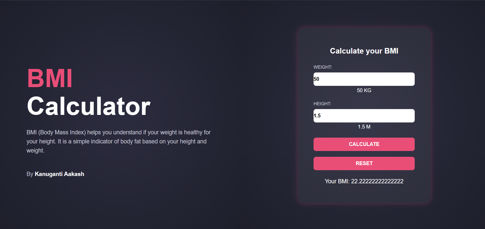

# 💪 BMI Calculator Web App  

A sleek and responsive **BMI (Body Mass Index) Calculator** built using **HTML**, **CSS (Flexbox & Gradient UI)**, and **JavaScript**.  
This app allows users to calculate their BMI quickly by entering their **weight (kg)** and **height (m)**, displaying instant results in a clean, modern interface.

---
## 🚀 Live Demo

🔗 **Deployed Link:** [Click here to view the live app](https://your-deployment-link-here.com)

---
## 🧠 What is BMI?  

**BMI (Body Mass Index)** is a simple health indicator that helps you determine if your weight is healthy relative to your height.  
It is calculated using the formula:  

> 🧮 **BMI = Weight (kg) / (Height (m))²**

---



## 🚀 Features  

✅ Real-time input tracking for weight and height  
✅ Calculates BMI on a button click  
✅ “Reset” button to clear inputs and results  
✅ Beautiful dual-section layout using **Flexbox**  
✅ Fully responsive design for all screen sizes  
✅ Gradient backgrounds and modern glass-effect UI  

---

## 🧩 Tech Stack  

| Technology | Description |
|-------------|-------------|
| **HTML5** | Page structure and layout |
| **CSS3 (Flexbox)** | Styling and responsive design |
| **JavaScript (ES6)** | BMI calculation logic and event handling |

---

## 📁 Folder Structure  

📦 BMI-Calculator
┣ 📜 index.html # Main webpage
┣ 📜 style.css # Styling file with gradients and flex layout
┣ 📜 app.js # JavaScript logic for BMI calculation
┗ 📜 README.md # Project documentation


---

## 🎨 UI & Layout Overview  

### 🧱 Design
The page is divided into two halves using **Flexbox**:  
1. **Left Box (box1)** – Informational section with title, description, and author credit.  
2. **Right Box (box2)** – The interactive BMI calculator area.

Each box uses:
- A **radial gradient background** for depth  
- **Glassmorphism-style** calculator box  
- **Hover transitions** for buttons  
- **Rounded corners** and **soft shadows**

---

## ⚙️ Working Logic Explained (Step-by-Step)

### 🧩 JavaScript (`app.js`)
The logic revolves around three main interactions:

#### 1. Reading User Input
```js
let input1 = document.querySelector("#input1");
let input2 = document.querySelector("#input2");
These capture weight and height values entered by the user.

When users type in either box, event listeners update the visible values:

    input1.addEventListener("input", ()=>{
    value1.innerHTML = `${input1.value} KG`;
    });
    input2.addEventListener("input", ()=>{
    value2.innerHTML = `${input2.value} M`;
    });
💡 This gives instant feedback — users see their input values reflected in real-time.

2. Calculating BMI
When the “CALCULATE” button is clicked:

    calc.addEventListener("click", ()=>{
    let weight = parseFloat(input1.value);
    let height = parseFloat(input2.value);
    let res = weight / (height * height);
    result.innerHTML = `Your BMI: ${res}`;
    });
Converts inputs to floating-point numbers

Applies the BMI formula: BMI = weight / (height²)

Displays the calculated BMI in the results paragraph

🧮 Example:
If Weight = 70kg and Height = 1.75m,
BMI = 70 / (1.75 × 1.75) = 22.86

3. Resetting the Calculator
The “RESET” button restores everything to default:
    reset.addEventListener("click", ()=>{
    value1.innerHTML = `0 KG`;
    value2.innerHTML = `0 M`;
    result.innerHTML = `Your BMI: 0`;
    input1.value = "";
    input2.value = "";
    });
✔ Clears the fields
✔ Resets labels
✔ Ready for a new calculation instantly

🧮 Understanding the BMI Formula
BMI Range	Category
Below 18.5	Underweight
18.5 – 24.9	Normal Weight
25 – 29.9	Overweight
30 and above	Obese

(You can extend the app to display these categories dynamically.)

🖥️ Preview
💡 Before Calculation:

Weight: 0kg, Height: 0m, BMI: 0.0

💡 After Calculation:

Weight: 68kg, Height: 1.70m → BMI: 23.5

🧠 How to Run
Clone this repository:

git clone https://github.com/your-username/bmi-calculator.git
Open the project folder:

cd bmi-calculator
Open index.html in your browser.
That’s it — your BMI Calculator is live!

📱 Responsive Design
On smaller screens, Flexbox automatically stacks the sections vertically.

Font sizes and padding adjust dynamically for better readability.

🌈 Future Enhancements
🚀 Add BMI category display (Underweight/Normal/Overweight/Obese)
🚀 Add input sliders for smooth control
🚀 Add color-coded BMI feedback (green = normal, red = high)
🚀 Store BMI history using localStorage

👨‍💻 Author
Developed by Kanuganti Aakash
Made with ❤️ using HTML, CSS, and JavaScript

📜 License
This project is licensed under the MIT License — feel free to use and modify it!

🧩 In Short — Remember the Logic:
1️⃣ Take weight & height inputs
2️⃣ Compute BMI = weight / (height²)
3️⃣ Display result
4️⃣ Reset values if needed